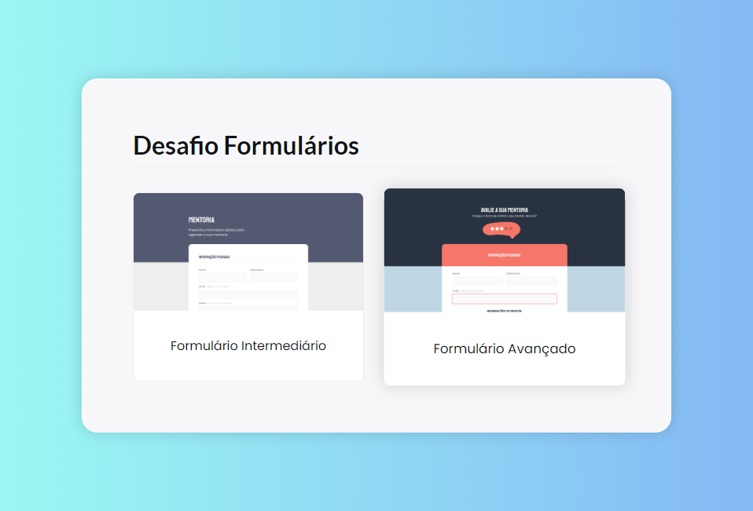

<h1 align="center">Formulários</h1>

Explorer | Stage 03 - Desafio Formulários

  <a href="#-tecnologias">Tecnologias</a>&nbsp;&nbsp;&nbsp;|&nbsp;&nbsp;&nbsp;
  <a href="#-licença">Licença</a>&nbsp;&nbsp;&nbsp;|&nbsp;&nbsp;&nbsp;
  <a href="#autor">Autor</a>

  

 

  
  <a href="https://jordane-chaves.github.io/challenge-explorer-criando-formularios/" target="_blank" rel="noopener noreferrer">
    🌐 Clique aqui para cessar o projeto
  </a>

## 🚀 Tecnologias

Esses projetos foram desenvolvidos com as seguintes tecnologias:

- HTML
- CSS

## 📝 Licença

Esse projeto está sob a licença MIT.

## Autor

 

Feito com 💜 por Jordane Chaves