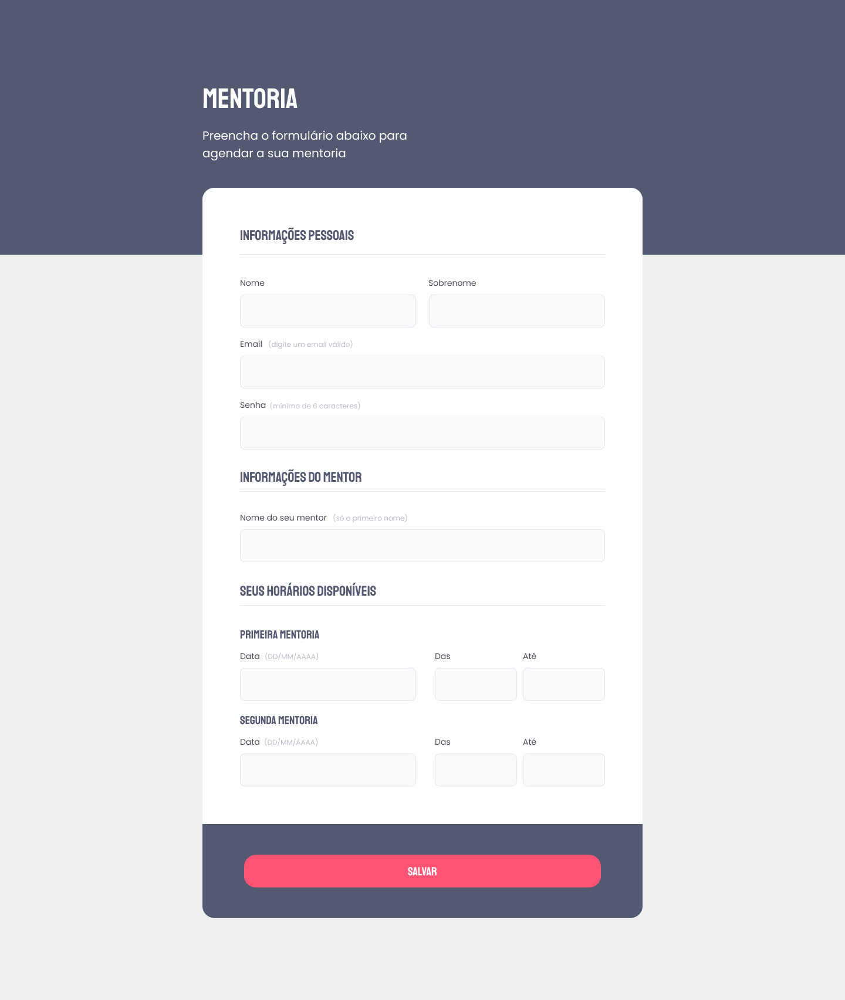

<h1 align="center">Formulário Mentoria</h1>

Explorer | Stage 03 - Desafio Formulário Intermediário

  <a href="#-tecnologias">Tecnologias</a>&nbsp;&nbsp;&nbsp;|&nbsp;&nbsp;&nbsp;
  <a href="#-projeto">Projeto</a>&nbsp;&nbsp;&nbsp;|&nbsp;&nbsp;&nbsp;
  <a href="#-licença">Licença</a>&nbsp;&nbsp;&nbsp;|&nbsp;&nbsp;&nbsp;
  <a href="#autor">Autor</a>

  

 

  

## 🚀 Tecnologias

Esse projeto foi desenvolvido com as seguintes tecnologias:

- HTML
- CSS

## 💻 Projeto

Este projeto é parte de um dos desafios do curso Explorer da [Rocketseat](https://www.rocketseat.com.br/).

Nele fiz a recriação de um formulário a partir do layout do Figma com o intuito de trabalhar e reforçar os conceitos:

- Entendimento de como funcionam os formulários;
- Agrupamento de campos;
- Estilização dos campos;
- Customização de checkbox;
- Validação de campos;
- Envio do formulário;

Além do que foi ensinado, adicionei também responsividade à página.

## 📝 Licença

Esse projeto está sob a licença MIT.

## Autor

 

Feito com 💜 por Jordane Chaves